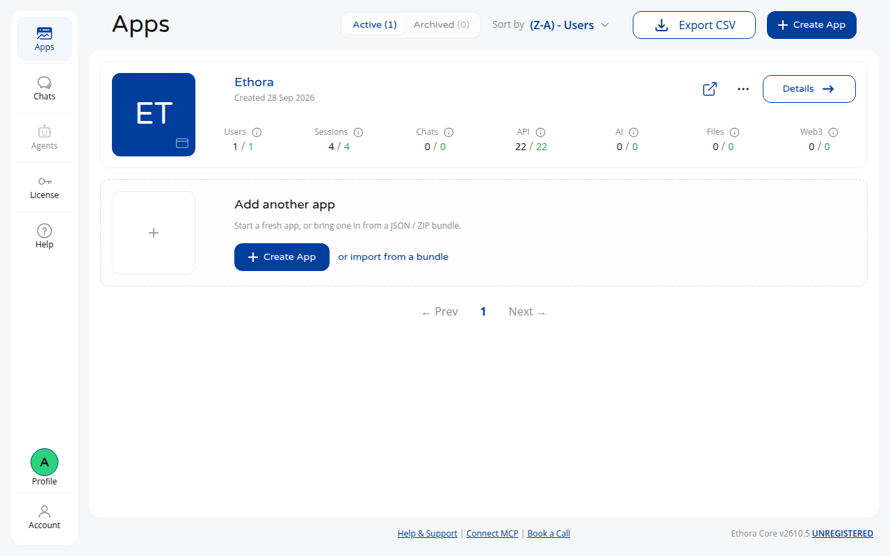
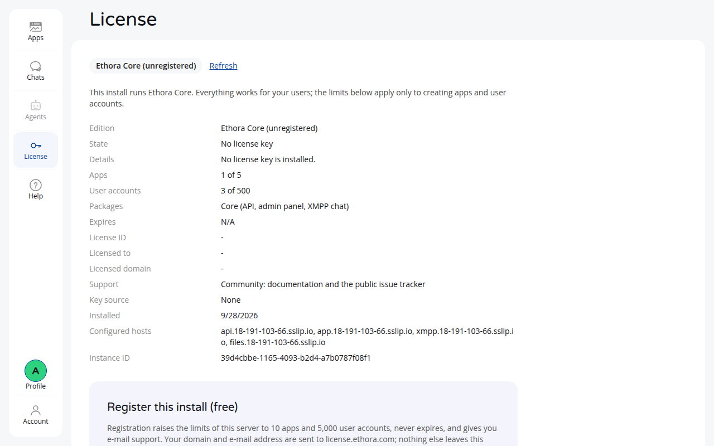

# Ethora Core: self-hosted chat server

[Ethora](https://ethora.com) is a chat and messaging platform you run on your
own server: an API, a web chat and admin panel, and an XMPP server, with
mobile and web SDKs on top. **Ethora Core is free**, no license key needed,
with per-server limits (see [Editions](#editions)).

This repository installs and updates it from published Docker images. One
command installs, one updates.

## Quick start

On a fresh Ubuntu 22.04 or 24.04 server (2 vCPU, 4 GB RAM, ports 80 and 443
open), as a user with `sudo`:

```bash
git clone https://github.com/dappros/ethora-install.git ~/ethora-install-shared
cd ~/ethora-install-shared
deploy/scripts/setup.sh --domain chat.example.com --admin-email you@example.com
sudo deploy/scripts/install.sh
```

About 10 minutes later, open `https://app.chat.example.com` and sign in with
your e-mail and the password `setup.sh` printed.

Or, as one line (it clones this repository and runs the same two steps,
asking for anything you leave out):

```bash
curl -fsSL https://raw.githubusercontent.com/dappros/ethora-install/2610/get.sh | bash -s -- --domain chat.example.com --admin-email you@example.com
```

Before you run it, create four DNS records pointing at the server, all plain
`A` (or `AAAA`) records, no proxy:

| Record | Points to |
|---|---|
| `api.chat.example.com` | your server's IP |
| `app.chat.example.com` | your server's IP |
| `xmpp.chat.example.com` | your server's IP |
| `files.chat.example.com` | your server's IP |

(`chat.example.com` is your root; every host derives from it. A wildcard
`*.chat.example.com` record covers all four.)

**No domain yet?** Use a magic DNS name for a test install: with server IP
`203.0.113.10`, pass `--domain 203-0-113-10.sslip.io`. It resolves
everywhere, gets a real Let's Encrypt certificate, and needs no DNS setup.

## What it looks like

The admin panel after a fresh install (`Ethora Core v2610.5 UNREGISTERED`
in the corner) and the License page where you register for free:





## What the two commands do

`setup.sh` writes `deploy/config/deploy.yml`: it derives the four hostnames
from your root domain, generates every secret and password, and prints the
admin password once. Run it with no flags to be prompted instead. Nothing is
installed yet; the file is fully commented and can be edited before the
next step.

`install.sh` installs Docker, nginx and certbot if they are missing, pulls the
images from Docker Hub, obtains certificates, starts the databases and the
three Ethora services, creates your base app and admin account, and runs a
health check. It is safe to run again after a failure.

What you get:

| Service | Image | Host |
|---|---|---|
| API | `dappros/ethora-api` | `api.<root>` (Swagger at `/api-docs/`) |
| Web chat and admin panel | `dappros/ethora-frontend` | `app.<root>` |
| XMPP server (ejabberd with the Ethora modules) | `dappros/ethora-xmpp` | `xmpp.<root>` |
| File storage | MinIO | `files.<root>` |
| MongoDB, MySQL, Redis, Centrifugo | stock images | internal |

## Update

```bash
cd ~/ethora-install-shared
git pull
sudo deploy/scripts/update.sh --ref 2610
```

`2610` is the current release line (year and month); the branch you cloned
has the same name. Running the update on the same line pulls the latest
fixes. When a new line is announced, read
[docs/RELEASE_NOTES_OPERATORS.md](docs/RELEASE_NOTES_OPERATORS.md) and pass
the new line. Roll back with `--rollback <commit>` using the commit the
update log printed at its start.

## Editions

| | Ethora Core | Ethora Core, registered | Ethora Enterprise |
|---|---|---|---|
| Price | free | free | per agreement |
| How | just install | admin panel, License page, "Register for free" (domain plus e-mail) | license key from Dappros |
| Apps per server | 5 | 10 | unlimited |
| User accounts per server | 500 | 5,000 | unlimited |
| Push notifications, AI agents, compliance logging, SSO, multi-tenant hosting | | | included |
| Support | community | e-mail: support@ethora.com | SLA |

The limits only stop creating apps and accounts beyond them; nothing else
is ever gated and nothing expires. Details: [feature schedule](docs/legal/FEATURE_SCHEDULE.md).
Licence: [Ethora Core Software License](docs/legal/ETHORA_CORE_LICENSE.md).
Enterprise: [sales@ethora.com](mailto:sales@ethora.com).

## Where things are

| Path | Purpose |
|---|---|
| `~/ethora-install-shared` | this checkout, and the only `deploy.yml` |
| `~/ethora` | the live install (rebuilt by every update) |
| `~/ethora-data` | your data: MongoDB, MinIO, MySQL, Redis. Back this up. |

Useful commands:

```bash
deploy/scripts/health-check.sh          # every service, licence state, public URLs
docker ps                               # the containers
docker logs --tail 200 ethora-backend   # API log (ethora-backend-jobs, deploy-xmpp-1, ...)
sudo deploy/scripts/install.sh --reinstall --yes   # wipe the install (keeps your data)
```

## Common questions

- **Certificate failed.** DNS is not pointing at this server yet, or port 80
  is blocked. Fix it and run `sudo deploy/scripts/install.sh` again.
- **Port 80 or 443 in use.** Something else is listening (Apache, another
  nginx). Stop it; the installer runs its own nginx.
- **Can I put it behind Cloudflare?** Install with plain DNS records first;
  proxying can be switched on afterwards for `app.` and `api.`.
  `xmpp.` must stay unproxied.
- **Mobile apps?** The Ethora SDKs for iOS, Android and React connect to
  `api.<root>` and `xmpp.<root>`; see https://ethora.com/docs.
- **Where is the source?** Ethora Core ships as images. The SDKs and the
  web client are open source under the `dappros` organisation.

## Documentation

- [docs/OPERATOR_QUICKSTART.md](docs/OPERATOR_QUICKSTART.md): install, update, rollback, checks, licence, backup on one page.
- [deploy/README.md](deploy/README.md): the full reference (every configuration key, every service).
- [docs/runbooks/](docs/runbooks/): backup and restore, troubleshooting, migrations.
- [docs/legal/](docs/legal/): licence, feature schedule, support policy, privacy notice, third-party notices.

## Support

Security issues: see [SECURITY.md](SECURITY.md). Contributions: [CONTRIBUTING.md](CONTRIBUTING.md).

Run `deploy/scripts/health-check.sh` first; it names the failing component.
Open an issue in this repository, or e-mail
[support@ethora.com](mailto:support@ethora.com), with its output and the
install or update log. Never send `deploy.yml` or `.deploy.env`: they hold
every secret of your install.
