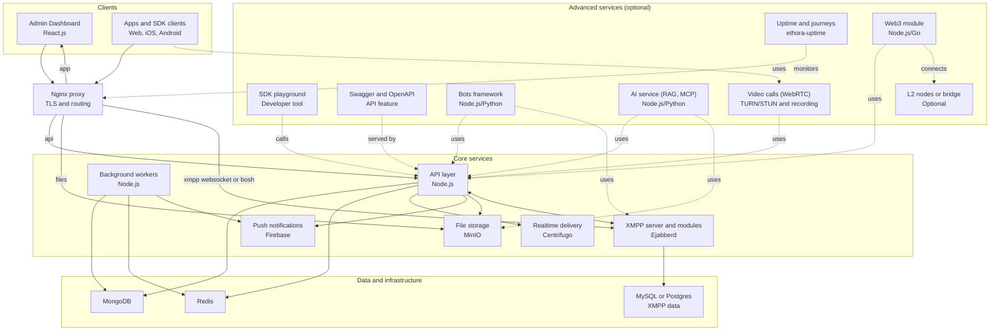

# Architecture

What the deploy wires together, the AI subsystem, and the system diagram. For the platform-level view see [PLATFORM_OVERVIEW.md](PLATFORM_OVERVIEW.md).

## AI subsystem notes

Current production behavior is hybrid:

- The public website widget is intended to talk to the app bot via direct `1:1` XMPP messages.
- The same per-app bot can also be deployed into an app room / MUC from admin settings.
- Some "direct message" flows in Ethora are implemented as private MUC rooms, so the AI bot may also need to auto-join invited MUC rooms at runtime.

Operationally this means:

- one `ai-service` PM2 process per server
- one self-hosted static widget bundle served from the `ethora-ai-chat-widget` submodule when `services.widget.enabled=true`
- one bot XMPP account per app
- anonymous widget visitors with temporary XMPP credentials
- MongoDB for bot / conversation state
- Postgres / pgvector for RAG embeddings

For deeper AI subsystem details, see `ethora-backend/services/ai/README.md`.

## Crawler callback (`DAPPROS_URL` + `CRAWLER_CALLBACK_SECRET`)

Site indexing runs in two passes. `POST /crawl` returns a shallow batch
(depth 2, ~10 pages) synchronously and the backend stores it from the HTTP
response. The crawler then queues a deep pass (depth 10, up to 100 pages) on a
background thread and POSTs that result to `DAPPROS_URL/<appId>` - it appends
the app id itself, so the configured value must not contain one.

The receiver is `POST /v1/sources/site-crawl/internal-for-crawler/:appId`.

That route has no auth middleware - the crawler holds no user or app token - so
it authenticates with a shared secret in the `x-secret` header.
`setup-env.sh` generates `CRAWLER_CALLBACK_SECRET` once, keeps it stable across
updates, and renders the same value into both the backend `.env` and the
crawler's env. The backend **fails closed**: with no secret configured it
rejects every callback with `403 CRAWLER_SECRET_NOT_CONFIGURED`, and a mismatch
gives `403 CRAWLER_SECRET_INVALID`. Both are recorded via `auditLog` as
`sources_internal_for_crawler_denied`.

If you change the secret, the backend and the crawler must both pick it up  - 
restart the backend (`pm2 restart backend --update-env`) *and* recreate the
crawler container. Restarting the crawler alone will not re-read `env_file`.

`DAPPROS_URL` reaches the container through
`deploy/generated/crawler/crawler.env`, rendered by `setup-env.sh` from
`deploy/templates/crawler.env.template` and wired in as the `crawler` service's
`env_file`. The default target is
`http://host.docker.internal:<backend port>/v1/sources/site-crawl/internal-for-crawler`
(compose adds the `host.docker.internal:host-gateway` entry so this resolves on
Linux). Override with `services.crawler.callback_url` only when the backend
isn't reachable on the docker host gateway - prefer an internal address, since
the receiving route carries no auth middleware.

Symptom when this is unset:

```
Crawled 80 pages in total
Successfully crawled 50 pages with content
sending to  None/<appId>
Unexpected error: Invalid URL 'None/<appId>': No scheme supplied.
```

Indexing then looks like it works - the shallow batch lands - while every page
found by the deep pass is silently dropped. Verify with:

```bash
docker exec crawler-service env | grep -E 'DAPPROS_URL|CRAWLER_CALLBACK_SECRET'
```

`deploy/scripts/health-check.sh` checks both variables and posts an empty body
through the real callback path, so a URL, secret, or reachability problem shows
up as a failed check rather than as missing pages weeks later.

## AI embeddings Postgres

The managed AI database is first-class in the deploy flow:

- `install.sh` / `update.sh` start `deploy/docker-compose.ai.yml` when `services.ai_service.enabled=true` and `services.ai_service.pg_url` is empty
- `setup-node-services.sh` initializes the schema from `ethora-backend/services/ai/ai-service/drizzle/0000_massive_fat_cobra.sql` before PM2 starts `ai-service`
- `health-check.sh` verifies the managed AI Postgres container plus the `documents` table

Relevant `deploy.yml` settings:

```yaml
services:
  ai_service:
    enabled: true
    port: 8013
    postgres_port: 5434
    postgres_database: ai_service_embeddings_db
    postgres_user: ai_embeddings
    postgres_password: ""
    pg_url: ""
```

Notes:

- Leave `pg_url` empty to use the managed local pgvector service.
- Set `pg_url` to a full external connection string if you want deploy to skip provisioning the local AI Postgres container.
- The AI embeddings database is separate from the optional Uptime Postgres database.

## High-level system diagram (enterprise overview)

This diagram is intentionally high-level (suitable for CIO/CTO audiences). It shows **core services** included in a dedicated Ethora deployment, plus **optional advanced services** that can be enabled depending on license/project requirements.



```
┌─────────────────────────────────────────────────────────┐
│                    Nginx (Port 80/443)                   │
│  ┌──────────┐  ┌──────────┐  ┌──────────┐  ┌─────────┐│
│  │   API    │  │   Web    │  │  Files   │  │   XMPP  ││
│  │ Domain   │  │ Domain   │  │ Domain   │  │ Domain  ││
│  └────┬─────┘  └────┬─────┘  └────┬─────┘  └────┬────┘│
└───────┼─────────────┼──────────────┼──────────────┼──────┘
        │             │              │              │
        ▼             ▼              ▼              ▼
┌──────────────┐ ┌──────────┐ ┌──────────┐ ┌──────────────┐
│   Backend    │ │ Frontend │ │  MinIO   │ │   Ejabberd   │
│  (PM2)       │ │  (Static)│ │ (Docker) │ │   (Docker)   │
│  Port 8080   │ │          │ │ Port 9000│ │ Ports 5280/  │
│              │ │          │ │          │ │     5443     │
└──────┬───────┘ └──────────┘ └──────────┘ └──────┬───────┘
       │                                          │
       ▼                                          ▼
┌─────────────────────────────────────────────────────────┐
│              Docker Services (docker-compose)           │
│  ┌──────────┐  ┌──────────┐  ┌──────────┐  ┌──────────┐│
│  │ MongoDB  │  │  Redis   │  │ Centrifugo│ │  MySQL   ││
│  │ Port     │  │ Port     │  │ Port     │ │ Port     ││
│  │ 27017    │  │ 6379     │  │ 8001     │ │ 3306     ││
│  └──────────┘  └──────────┘  └──────────┘  └──────────┘│
└─────────────────────────────────────────────────────────┘
```
